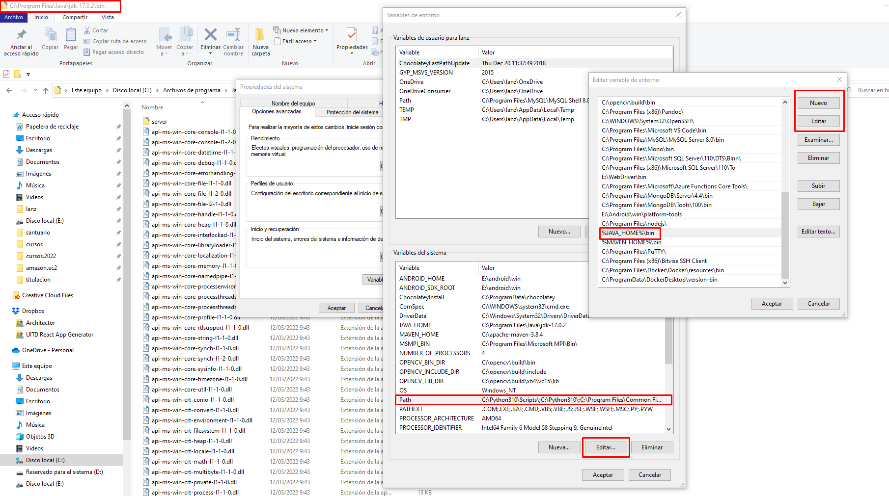

# Sesión 2.B - Java JDK: Instalación, Compilación y Ejecución


    Diplomado de Java - Módulo I
    Departamento de Diplomados y Extensión Profesional
    Centro de Investigación en Cómputo
    Instituto Politécnico Nacional

---

[](https://github.com/dragonnomada) Por [Alan Badillo Salas](https://github.com/dragonnomada)

---

## Introducción

En esta sesión aprenderemos a instalar, compilar y ejecutar archivos de Java. También veremos el `Classpath`, las variables y estructuras de control del lenguaje.

## Instalación de Java JDK

> Figura 4.1 - Página de descarga de Java


[https://www.oracle.com/java/technologies/downloads/](https://www.oracle.com/java/technologies/downloads/)

> Figura 4.2 - Instalación

    NOTA: Copiar la ruta donde será instalado el JDK

    >>> C:\Program Files\Java\jdk-17.0.2


### Configuración de Java JDK

> Figura 4.3 - Ubicamos la carpeta del JDK


> Figura 4.4 - Abrir la `Configuración Avanzada del Sistema`


> Figura 4.5 - Abrir las `Variables de Entorno`


> Figura 4.6 - Ajustar las `Variables del Sistema`


> Figura 4.7 - Crear la variable `JAVA_HOME` con la ruta al JDK


> Figura 4.8 - Eliminar de `Path` los `javapath`

    NOTA: Esto suprime la versión jre 1.8.X

    >>> Dejamos sólo el JDK


> Figura 4.9 - Agregamos a `Path` el `%JAVA_HOME\bin%`

    NOTA: Esto activa el JDK



### Verificación de Java JDK

> Figura 4.10 - Abrimos la configuración de Java


> Figura 4.11 - Se muestra el Panel de Control de Java


> Figura 4.12 - Opcionalmente podemos actualizar

    NOTA: Se puede desactivar la actualización


> Figura 4.12b - Agregamos el JDK al Java Runtime Environment


> Figura 4.13 - Verificamos `java -version`, `javac -version`, `jconsole`


> Figura 4.14 - Revisamos la consola de monitoreo de la JVM


## Compilación y Ejecución de Clases

Todas las clases de Java se pueden compilar, sin embargo sólo algunas serán ejecutables.

La siguiente lista numera algunas restricciones de Java.

* Las clases, interfaces o enumeraciones se tienen que llamar igual que el archivo.
* Por convención se utiliza la notación PascalCase, donde las clases, interfaces y enumeraciones se nombran con una Mayúscula inicial, seguido de minúsculas, y en cada cambio de palabra se alterna de minúsculas a Mayúsculas.
* Las clases tienen la posibilidad de ser ejecutables, es decir, que las ejecutemos como programas, si definimos un punto de entrada, dicho punto de entrada es un método de ejecución llamado `main` el cual debe ser público, estático, que no devuelva nada (`void`) y que reciba los argumentos pasados mediante un arreglo de textos (`String`). Es decir, `public static void main(String[] args) { ... }`.

### 1. Definir una clase que sea ejecutable (con punto de entrada/ejecución)

> Hola.java

```java
class Hola {
  
  public static void main(String[] args) {
    System.out.println("Hola Java :D");
  }

}
```

### 2. Compilar la clase `Hola.java` en el archivo `bytecode` `Hola.class`

    $ javac Hola.java

    --> Hola.class

### 3. Ejecutar el archivo `Hola.class` (sin la extensión)

    $ java Hola

    >>> Hola Java :D

### Notas

    TODO: Colocar cualquier expresión válida de Java
    - Definir variables
    - Instanciar objetos
    - Llamar a métodos estáticos
    - Llamar a métodos de los objetos
    - Leer datos de la entrada estándar (teclado)
    - Escribir datos a la salida estándar (consola)
    - Crear ventanas con Swing, Iniciar un Servidor, ...

    Podemos imprimir hacía la salida estándar
    mediante la clase `System`, el subpaquete `out`
    y los métodos `println`, `printf`, ...

## Tipos de Datos en Java

Existen dos tipos de datos principales en Java, los `datos primitivos` que se refiere a tipos básicos que no son objetos, y los `objetos` los cuáles provienen de clases estándar o generadas por el usuario.

> Tabla de Tipos de Datos Primitivos principales en Java

Tipo | Naturaleza | Ejemplo | Descripción
--- | --- | --- | ---
`int` | Entero | `123` | Retiene un número entero de `16/32 bits`
`float` | Decimal Corto | `123.456f` | Retiene un número con decimales cortos en `32 bits` (signo `1 bit`, exponente `8 bits` y `23 bits`).
`double` | Decimal Largo | `123.456...` | Retiene un número con decimales largos en `64bits`
`char` | Caracter | `'A', '\n', '\t'` | Retiene un caracter ascii (o utf-8) entrecomillado con comillas simples (`'`)
`byte` | Byte | `0x00`, `0xFF`, `0-255` | Retiene `8-bits` de información y es usado para transmisión de archivos, cifrado, manejo de imágnes, vídeos, audio, etc.
`boolean` | Booleano/Lógico | `true`, `false` | Retiene un dato verdadero o falso, se usa para crear banderas lógicas, determinar condiciones o estructurar predicados lógicos.

### Variables

Una variable es un almacén de datos, el cuál está asociado a un *tipo de dato* y Java reservará el espacio necesario para guardar y acceder los datos desde la memoria y hacía la memoria mediante un nombre especificado como *el nombre de la variable*. Es decir, podemos nombrar espacios de memoria para utilizarlos como valores dentro de nuestro programa.

Podemos construir variables bajo la siguiente sintaxis.

    SINTAXIS: <tipo de dato> <nombre de la variable>;

    ALTERNATIVA: <tipo de dato> <nombre de la variable> = <valor>;

    EJEMPLO:

        int a;

        char tabulado = '\t';

El `<tipo de dato>` puede ser primitivo o un objeto, y el nombre sigue la convención de nombrado `camelCase`, la cuál nos indica comenzar el nombre de la variable en minúsculas, y alternar a mayúsculas en cada cambio de palabra (ejemplo `edad`, `peso`, `nombrePersona`, `estaEnCirculo`).

Cuándo la variable no es asignada, se considera una `declaración`, es decir, el tener `int a;` significa `declara la variabla a de tipo entero`, sin embargo, tener `int a = 123;` significa `declara la variable a de tipo entero y asigna su valor a 123`. Las variables por defecto pueden reasignar su valor (`<nombre> = <valor>`) a menos que sean marcadas como inmutables mediante `const`.

> Ejemplo 2b.1 - Calcular el área de un círculo dado un radio

```java
double radio = 1.0;

double pi = 3.141592653;

double area = pi * radio * radio;

System.out.printf("El área del círculo de radio %.2f es %.2f\n", radio, area);
```

### Impresión con formato

El método `System.out.printf(...)` nos permite imprimir una plantilla (un texto llamado el formato), usando parámetros de reemplazo. Según el tipo de dato podremos imprimir los parámetros adecuados.

> Formatos para los tipos de datos principales

Formato | Tipo | Ejemplo | Descripción
--- | --- | --- | ---
`%d` | Entero | `"La edad es %d años", edad` | Reemplaza un entero en la posición del `%d`
`%f` | Decimales | `"El peso es %f kilogramos", pesos` | Reemplaza un decimal en la posición del `%f`
`%c` | Caracter | `"La tecla pulsada es: %c", tecla` | Reemplaza un caracter en la posición del `%c`
`%b` | Booleano | `"Activo: %b", activo` | Reemplaza un booleano en la posición del `%b` (en minúsculas `true`/`false`) 
`%B` | Booleano | `"Activo: %b", activo` | Reemplaza un booleano en la posición del `%B` (en minúsculas `TRUE`/`FALSE`) 
`%x` | Hexadecimal | `"Hexadecimal: %x", valor` | Imprime el valor en hexadecimal, ya sea entero o byte (minúsculas `0xff`)
`%X` | Hexadecimal | `"Hexadecimal: %X", valor` | Imprime el valor en hexadecimal, ya sea entero o byte (mayúsculas `0xFF`)
`%o` | Octal | `"Octal: %o", valor` | Imprime el valor en octal, ya sea entero o byte
`%s` | Texto | `"Tu nombre es %s", nombre` | Reemplaza un texto (`String` o `toString()`) en la posición del `%s`

Algunas variantes es definir la longitud máxima, por ejemplo `%5d` muestra sólo hasta 5 dígitos, `%10s` muestra sólo hasta 10 caracteres, `%.4f` muestra 4 decimales después del punto, `%5.3f` muestra hasta 5 dígitos y 3 decimales.

[REFERENCIAS]

* [https://www.javatpoint.com/java-string-format](https://www.javatpoint.com/java-string-format)

## Arreglos de Variables

Un arreglo de datos es similar a una variable que reserva la memoria necesaria para guardar tantos datos finitos como se necesites. Por ejemplo, si queremos almacenar `100` números, `50` textos, `200` caracteres, `2 millones` de bytes, etc. Los arreglos poseen un índice el cuál nos permitirá asignar y obtener los datos de una posición en particular, partiendo de cero. Por ejemplo, obtener del arreglo el valor en la `5ta` posición (índice 4), cambiar el valor del arreglo en la `12va` posición (índice 11), u obtener el valor de la `1ra` (índice 0).

Cualquier tipo de dato se puede volver un arreglo, es decir, un conjunto ordenado y finito de valores del mismo tipo de datos, mediante la sintaxis de los `[]`. Las posiciones para los valores dentro del arreglo comenzarán en 0.

    SINTAXIS: <tipo>[] <nombre> = new <tipo>[<tamaño>];

    EJEMPLO:

    double[] calificaciones = new double[30];

> Ejemplo 2b.2 - Generar una tabla con los valores de una parábola

```java
double[] x = new double[100];
double[] y = new double[100];

for (int i = 0; i < 100; i++) {
    x[i] = -10 + i * 0.2;
}

for (int j = 0; j < 100; j++) {
    y[j] = x[j] * x[j];
}

for (int k = 0; k < 100; k++) {
    System.out.printf("| %04.2f | %04.2f |\n", x[k], y[k]);
}
```

## Estructuras de Control

### Condicionales

Las condicionales `if` nos permiten evaluar un código, si la condición se cumple.

    SINTAXIS:

    # Forma Canónica

    if ( <condición> ) {
        <<código si se cumple la condición>>
    }

    # Forma Dual

    if ( <condición> ) {
        <<código si se cumple la condición>>
    } else {
        <<código si no se cumple la condición>>
    }

    # Forma Anidada

    if ( <condición 1> ) {
        <<código si se cumple la condición 1>>
    } else if ( <condición 2> ) {
        <<código si no se cumple la condición, 
            pero si se cumple la condición 2>>
    } if ( <condición N> ) {
        <<código si no se cumplen las condiciones anteriores,
            pero si se cumple la condición N>>
    } else {
        <<código si no se cumple ninguna condición anterior>>
    }

### Iteradores

Hay dos formas de crear iteradores, de la forma tradicional (`PARA <iterando> <- <valor inicial> HASTA <valor final> CON PASO <incremento> HACER`) o recorriendo cada elemento de una secuencia (lista, arreglo, iterable, etc).

    SINTAXIS:

    # Forma Canónica

    for (<tipo> <iterando> = <inicial>; <condición>; <incremento>) {
        <<código para cada iteración>>
    } 

    # Forma Para-Cada

    for (<tipo> <valor> : <iterable>) {
        <<código para cada elemento del iterable>>
    }

La diferencia entre los dos tipos de iteradores consiste en incrementar manualmente cada iteración (`<incremento>`) y determinar la condición de paro (`<condición>`) o recorrer cada elemento (`<valor>`) de un iterable (`<iterable>`). Si no deseamos saber el índice del elemento, la segunda forma podría ser más cómoda.

### Ciclos

Los ciclos nos permitirán repetir un bloque de código, mientras la condición se cumpla. En Java tenemos la variante `MIENTRAS` y `HACER-MIENTRAS`.

    SINTAXIS:

    # Forma Canónica

    while ( <condición> ) {
        <<código mientras se cumpla la condición>>
    }

    # Forma Hacer-Mientras

    do {
        <<código ejecutado la primera vez y mientras se cumpla la condición>>
    } while ( <condición> );

## Ejercicios

> Ejercicio 2b.E1 - Sumar dos números enteros

    PSEUDOCÓDIGO:

    DEFINIR a COMO entero;
    DEFINIR b COMO entero;
    DEFINIR c COMO entero;

    IMPRIMIR "Dame A:";
    LEER a;

    IMPRIMIR "Dame B:";
    LEER b;

    c <- a + b;

    IMPRIMIR "C = " c;

```java
// import java.util.Scanner;

int a;
int b;
int c;

Scanner sc = new Scanner(System.in);

System.out.printf("Dame A: ");
a = sc.nextInt();

System.out.printf("Dame B: ");
b = sc.nextInt();

c = a + b;

System.out.printf("C = %d\n", c);

sc.close();
```

> Ejercicio 2b.E2 - Sumar los números de una lista de enteros

    PSEUDOCÓDIGO:

    DEFINIR lista COMO entero;
    DIMENSION lista[5];

    lista[0] <- 2;
    lista[1] <- 6;
    lista[2] <- 5;
    lista[3] <- 3;
    lista[4] <- 1;

    DEFINIR suma COMO entero;

    suma <- 0;

    DEFINIR i COMO entero;

    PARA i <- 0 HASTA 4 CON PASO 1 ENTONCES
        suma <- suma + lista[i];
    FIN PARA

    IMPRIMIR "La suma es: " suma;