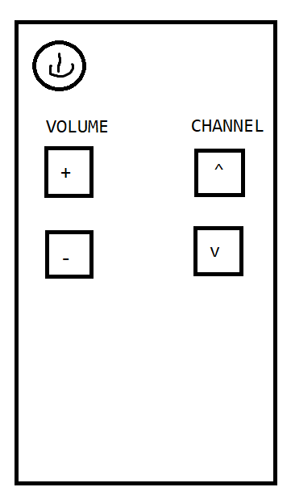

# Sesión 3.B - Ejercicio 1

## Descripción

Se requiere programar una clase llamada `ControlRemoto`, la cual funcione de la siguiente manera.

* El control debe tener un estado de encendio/apaga
* El control debe tener un volumen entero entre 0 y 100 comenzando en 50
* El control debe tener un canal entero entre 0 y 255 comenzando en 1
* El control debe tener la acción `encender()`
* El control debe tener la acción `apagar()`
* El control debe tener la acción `subirVolumen()`
* El control debe tener la acción `bajarVolumen()`
* El control debe tener la acción `siguienteCanal()`
* El control debe tener la acción `regresarCanal()`
* Se deben considerar los límites del volumen y el canal
* Y para el canal, si llega al 256, el canal debería regresar a 0

> Generar los siguientes puntos

1. El Diagrama de Clase
2. La clase `ControlRemoto` de Java (no ejecutable)
3. La clase de pruebas `TestControlRemoto` en Java (ejecutable)
4. Documentar cada línea de código (opcional)

5. 