# Creación de Proyectos y Paquetes

## Proyectos

Un proyecto es una carpeta física que contiene otras carpetas en la estructura
de un proyecto y podemos usar cualquier carpeta como un proyecto.

Sin embargo, para que quede correctamente estructurada como proyecto haremos
la configuración de proyecto dentro de *IntelliJ*.

> 1.

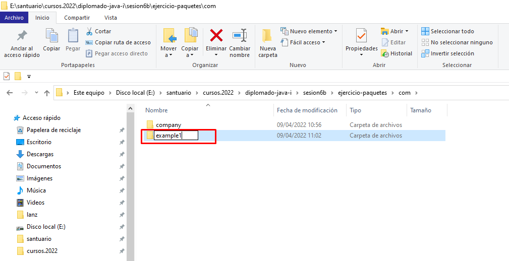

> 2.

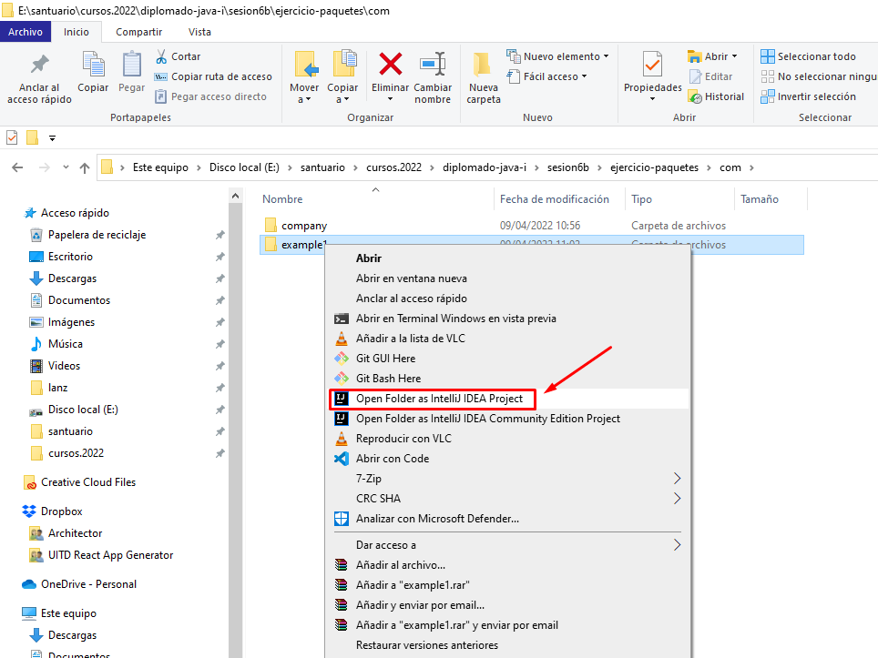

> 3.

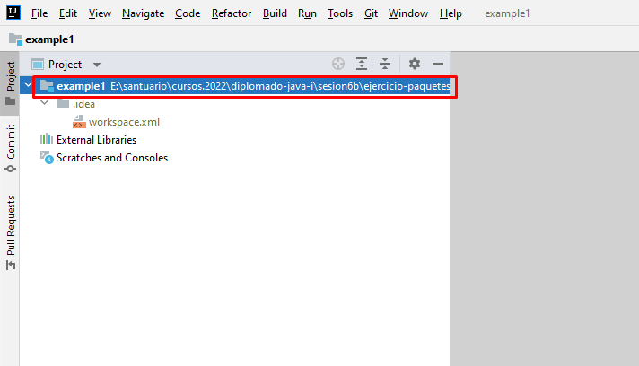

> 4.

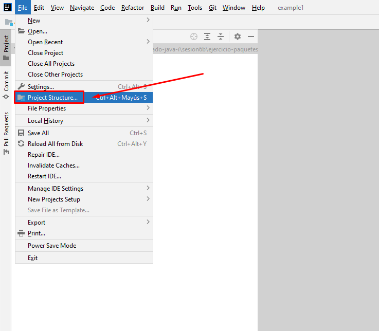

> 5.

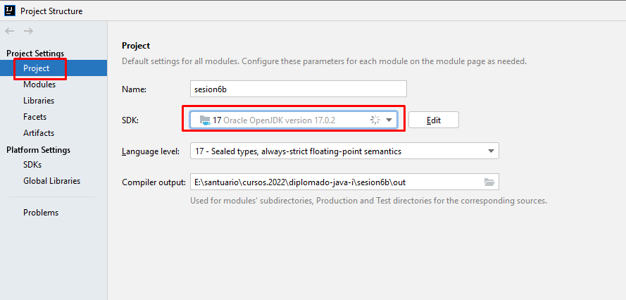

> 6.

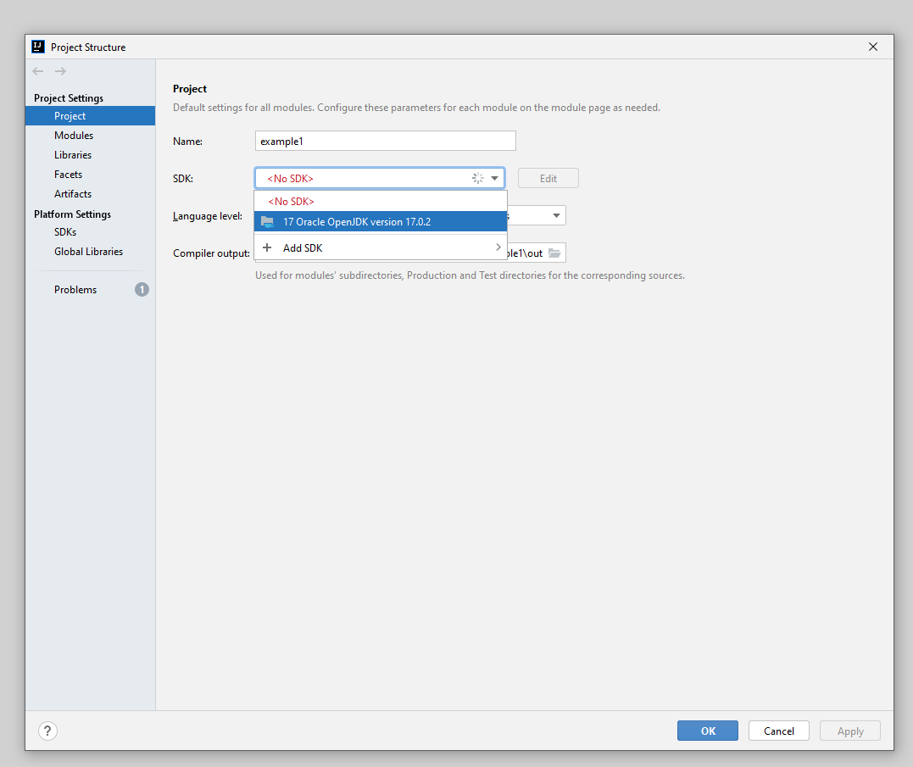

> 7.

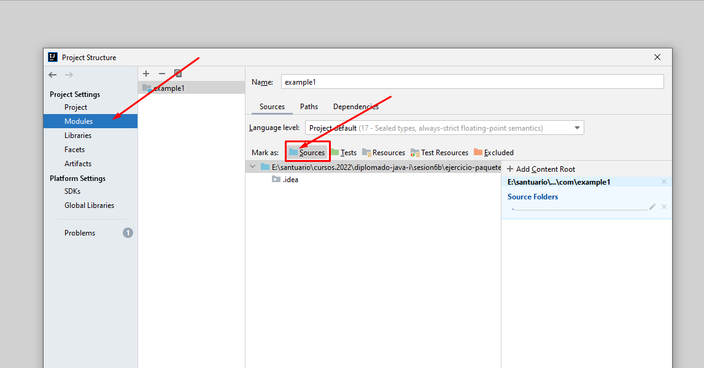

> 8.

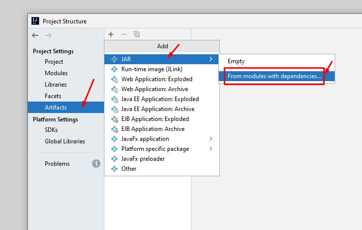

> 9.

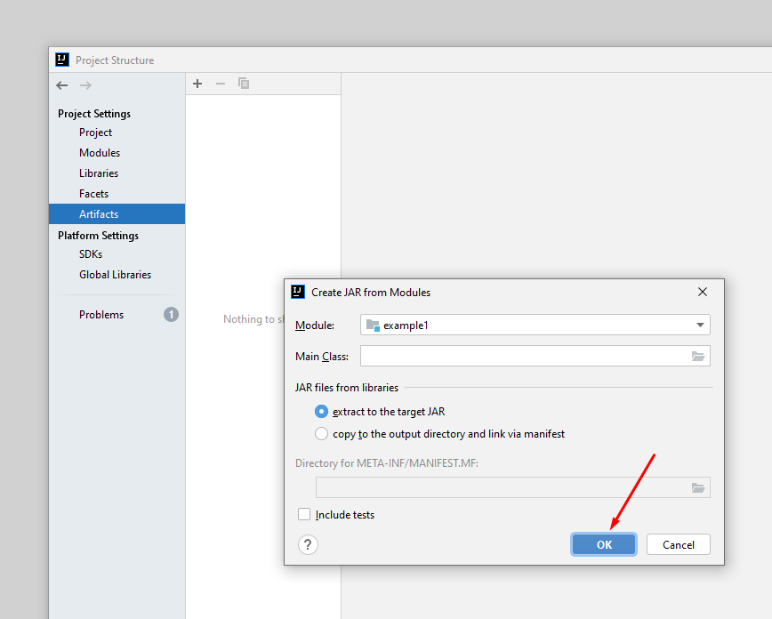

> 10.

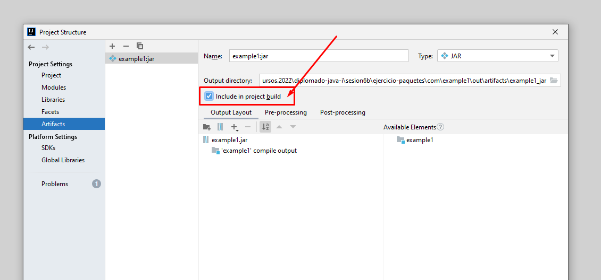

> 11.

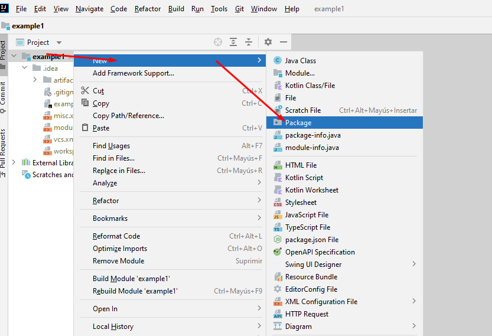

> 12.

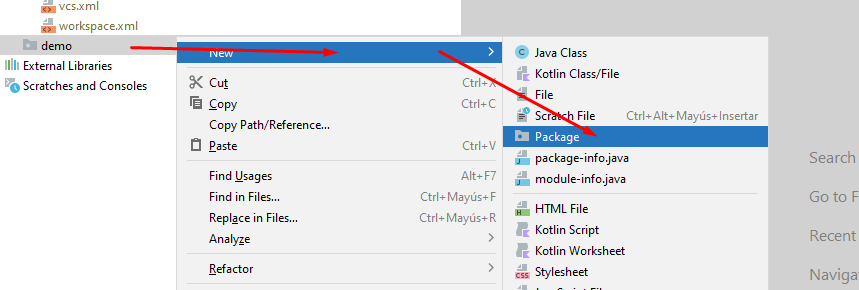

> 13.

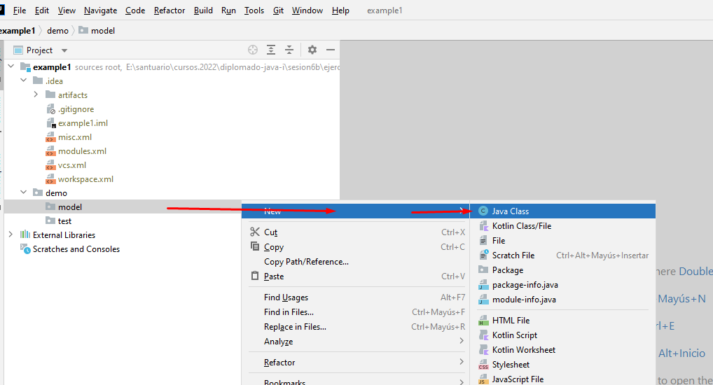

> 14.

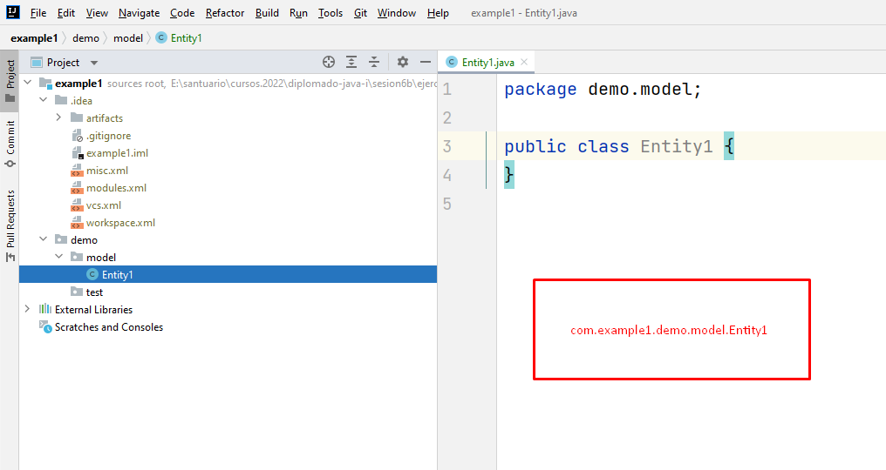

> 15.

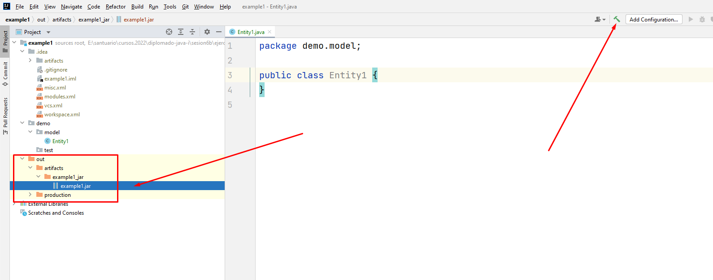

> 16.

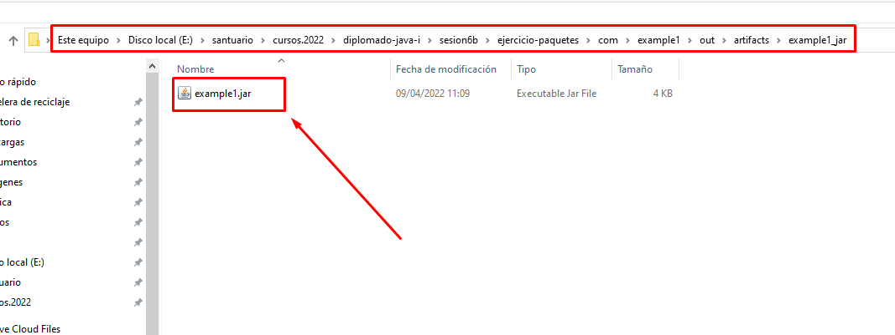

> 17.

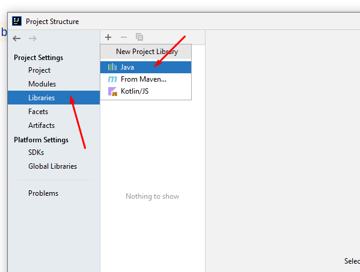

> 18.

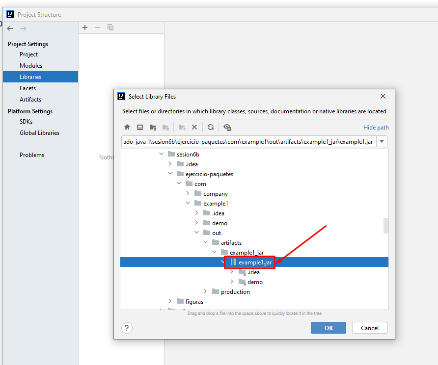

> 19.

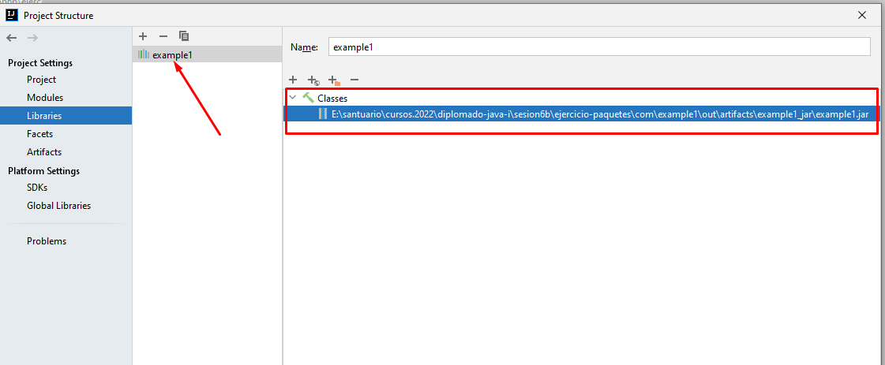

> 20.

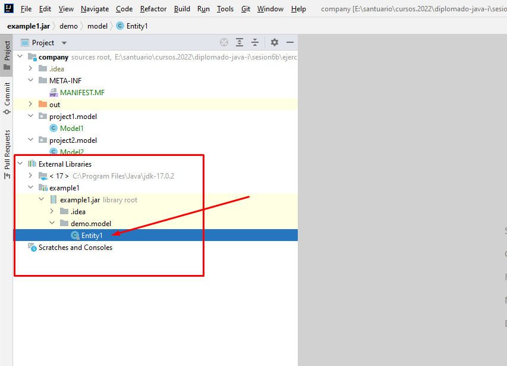